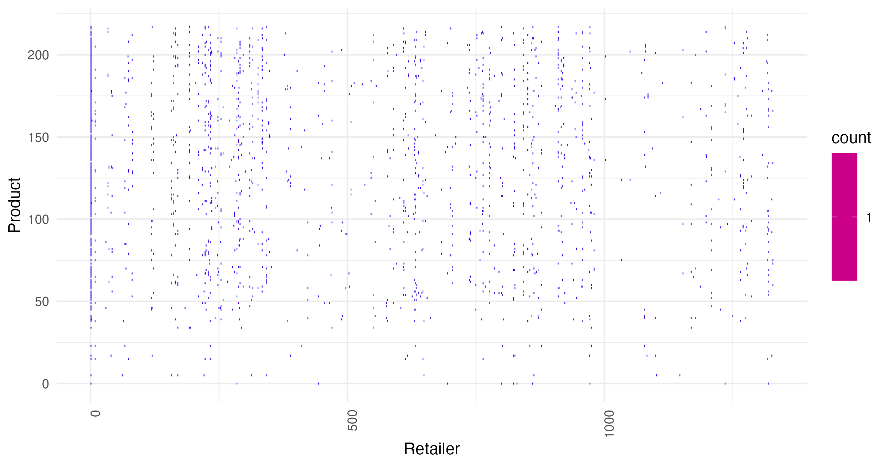
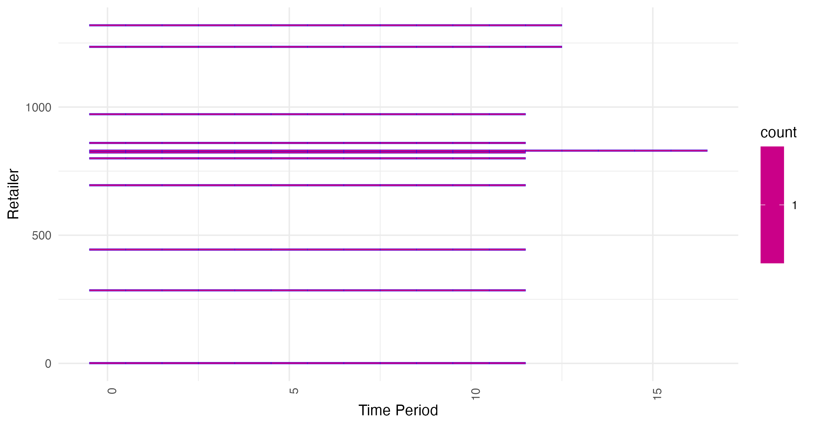

# FR-04 Slice and Dice Visualizer of (i, j, t) Tuples

**Author**: FR  
**Date**: 7th October 2024

This project implements a 3D visualization tool for analyzing the observational unit selection criteria result (please consult project `FR-03` for an understanding)
cube of retailers (`j`), products (`i`), and week running variable (`t`). The R Code reads data from a CSV file, processes it, and generates and interactive html page of the rendered data points (DP) in the whole possible selection criteria space 3D-cube.

## Visualizations

### Slice 1: Product vs. Retailer at Week t=10
This plot shows a 2D slice of the cube where given product-retailer relationship for a specific time period (t=week 10 f.e.).

### Slice 2: Retailer vs. Time for Product pos.=0
This plot shows a 2D slice of the cube where given a retailer-time relationship for a specific product (prod.-position=0).

### 3D Cube Visualization
This is an interactive 3D visualization using `plotly` of the entire `(i, j, t)` cube, where each point represents a in the data-set (see `FR-03` data-set) rendered product-retailer-time tuple identifying the observational unit row / obs.

[Click here](cube_visualization.html)

